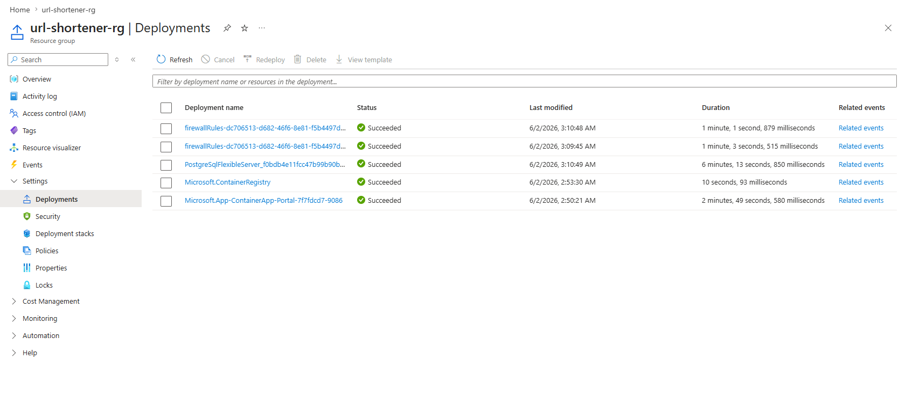
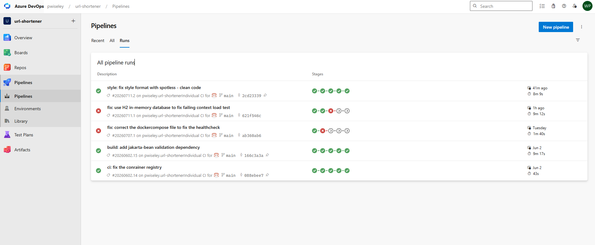
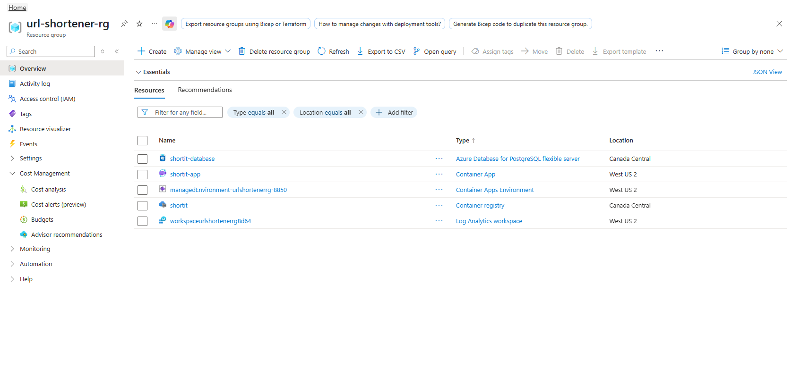

# ✂️ URL Shortener

> Full-stack URL shortening service with click analytics and redirect handling.

### [🚀 Live Demo](https://go.petiton.dev) · [📖 API Docs (Swagger)](https://go.petiton.dev/swagger-ui/index.html)


---

## What it does

Shortit takes any long URL and generates a short, shareable link. Each shortened link resolves through a redirect endpoint, and every resolution is tracked to provide basic click analytics per link. The service is built as a Spring Boot API with an Angular frontend, and ships to Azure Container Apps through a multi-stage Azure DevOps pipeline.

---

## Tech Stack

| Layer | Technology |
|---|---|
| Backend | Java 21, Spring Boot 3, Maven |
| Frontend | Angular, TypeScript |
| Database | PostgreSQL |
| CI/CD | Azure DevOps Pipelines |
| Hosting | Azure Container Apps, Azure Container Registry |
| Architecture | Controller / Service / Repository |

---

## Key Features

- URL shortening with unique short-code generation and collision handling
- Redirect endpoint resolving each short code to its original URL
- Click analytics per shortened link
- RESTful API with clean Controller / Service / Repository layering
- Bean Validation on submitted URLs
- Interactive API documentation via Swagger / OpenAPI
- Angular single-page frontend with a minimal, focused UX
- Dockerized and deployed on Azure Container Apps
- Multi-stage Azure DevOps pipeline with an integrated DevSecOps gate (SonarCloud, OWASP Dependency-Check, Trivy)

---

## CI/CD Pipeline

Every push to `main` runs a five-stage Azure DevOps pipeline:

| Stage | What it does |
|---|---|
| **Build** | Packages the backend with Maven |
| **Test** | Runs unit tests and publishes JUnit results |
| **Quality & Security** | Runs three parallel checks: code style with **Spotless**, code quality and coverage with **SonarCloud**, and dependency vulnerability scanning with **OWASP Dependency-Check** (cached DB) |
| **Push** | Builds the image, pushes it to Azure Container Registry, and scans it for vulnerabilities with **Trivy** |
| **Deploy** | Deploys the new image to Azure Container Apps |

Security and quality are enforced as part of the pipeline rather than as an afterthought: style, static analysis, dependency CVEs, and container image vulnerabilities are all gated before anything reaches production.

---

## API Endpoints

| Method | Route | Purpose |
|---|---|---|
| `POST` | `/api/urls` | Create a short URL from a long one |
| `GET` | `/{shortCode}` | Resolve a short code and redirect (`302 Found`) |

Full interactive documentation is available at **[/swagger-ui/index.html](https://go.petiton.dev/swagger-ui/index.html)**.

---

## API Examples

### Request — shorten a URL

```http
POST /api/urls
Content-Type: application/json
```

```json
{
  "originalUrl": "https://www.example.com/some/very/long/path?ref=newsletter"
}
```

### Successful response — `201 Created`

```json
{
  "shortCode": "a1B2c3",
  "originalUrl": "https://www.example.com/some/very/long/path?ref=newsletter",
  "shortUrl": "https://go.petiton.dev/a1B2c3"
}
```

### Error response — `400 Bad Request` (invalid URL)

Submitted URLs are validated before a code is generated:

```json
{
  "originalUrl": "Url has to start with http:// or https://"
}
```

Visiting `GET /{shortCode}` then issues a `302 Found` redirect to the original URL. See the full schemas at **[/swagger-ui/index.html](https://go.petiton.dev/swagger-ui/index.html)**.

---

## Deployment on Azure

The service runs on Azure Container Apps, with images built and stored in Azure Container Registry and shipped through the Azure DevOps pipeline.







---

## Related

- [insurance-quote](https://github.com/pwiseley/insurance-quote): Spring Boot + React, live at `primio.petiton.dev`
- [vehicle-maintenance-tracker](https://github.com/pwiseley/vehicle-maintenance-tracker): C# / ASP.NET Core + React, live at `vmt.petiton.dev`
- [Floppa Marketplace](https://github.com/pwiseley/Floppa-app): Java REST API, three-layer architecture, CI/CD
- [Portfolio](https://petiton.dev)
